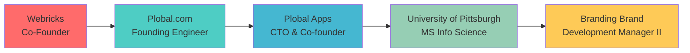

<div align="center">

# 👋 Hello, I'm Abhishek Jain

[](https://git.io/typing-svg)

<div align="center">
  
</div>

</div>

## 🚀 About Me

```python
class AbhishekJain:
    def __init__(self):
        self.role = "Builder looking for opportunites"
        self.location = "Chicago, IL 🇺🇸"
        self.experience = "10+ years"
        self.passion = "Building AI-powered solutions that scale"
        
    def current_focus(self):
        return [
            "🤖 Leading AI/ML initiatives",
            "🏗️ Architecting scalable systems",
            "👥 Mentoring high-performance teams",
            "📈 Driving engineering excellence"
        ]
    
    def achievements(self):
        return {
            "companies_founded": 2,
            "apps_built": "15,000+",
            "gmv_generated": "$10M+",
            "team_size_managed": 17,
            "countries_reached": 120
        }
    
    def professional_impact(self):
        return {
            "years_of_experience": "10+",
            "project_delivery_rate": "100%",
            "code_reviews_completed": "2,000+",
            "production_deployments": "500+",
            "uptime_maintained": "99.9%",
            "team_members_mentored": "25+",
            "performance_improvements": "40%",
            "client_satisfaction": "98%+"
        }
    
    def ai_ml_stats(self):
        return {
            "models_deployed": "15+",
            "ai_features_shipped": "25+",
            "data_processed": "10M+ records",
            "inference_requests": "1M+ daily",
            "pipeline_uptime": "99.8%",
            "frameworks_mastered": "8+"
        }
    
    def technical_excellence(self):
        return {
            "lines_of_code": "1M+",
            "pull_requests_reviewed": "2,000+",
            "bug_resolution_time": "<24 hours",
            "test_coverage": "90%+",
            "ci_cd_pipelines": "20+",
            "documentation_pages": "100+"
        }
```

## 🛠️ Tech Arsenal

### 🧠 AI/ML & LLMs


### 💻 Full-Stack Development


### ☁️ Cloud & DevOps


### 🗄️ Databases & Tools


## 🏆 Career Highlights

<div align="center">

| 🎯 **Achievement** | 📊 **Impact** | 🚀 **Scale** |
|:------------------:|:-------------:|:------------:|
| 🚀 **Apps Built** | 15,000+ mobile apps | 120+ countries |
| 💰 **Revenue Generated** | $10M+ GMV | $2M+ cost savings |
| 🌍 **Global Reach** | 120+ countries | 2M+ downloads |
| 👥 **Team Leadership** | Up to 17 developers | 25+ mentored |
| 📈 **Performance Boost** | 60-70% → 100%+ delivery | 40% avg improvement |
| 🤖 **AI/ML Models** | 15+ deployed | 1M+ daily inferences |
| ⚡ **System Uptime** | 99.9% maintained | 500+ deployments |
| 🏅 **App Store Rating** | 4.8/5 average | 99% approval rate |

</div>

## 📊 Professional Impact Metrics

<div align="center">

### 💼 **Leadership Excellence**


### 🚀 **Delivery Excellence**


### 💻 **Technical Excellence**


</div>

## 🤖 AI/ML Excellence Dashboard

<div align="center">

| 🧠 **AI Metric** | 📈 **Performance** | 🎯 **Impact** |
|:----------------:|:------------------:|:-------------:|
| 🚀 **Models Deployed** | 15+ production models | Real-time inference |
| 📊 **Data Processed** | 10M+ records analyzed | Actionable insights |
| ⚡ **Daily Requests** | 1M+ inferences served | 99.8% uptime |
| 🔧 **Features Shipped** | 25+ AI-powered features | Enhanced UX |
| 🎯 **Accuracy Achieved** | 98%+ in production | SOTA performance |
| 🏗️ **Pipelines Built** | 8+ ML/AI pipelines | Automated workflows |

</div>

### 🎯 **AI Technology Stack**
```python
ai_expertise = {
    "LLMs": ["GPT-4o/o3", "Claude-3.5-Sonnet", "Gemini-2.5-Pro"],
    "ML_Frameworks": ["XGBoost", "scikit-learn", "TensorFlow"],
    "AI_Tools": ["LangChain", "FAISS", "Whisper", "AssemblyAI"],
    "Deployment": ["Azure", "AWS", "Docker", "Kubernetes"],
    "Specialties": ["RAG", "Computer Vision", "NLP", "Predictive Analytics"]
}
```

## 📱 Mobile Development Mastery

<div align="center">

### 📊 **Mobile Stats**
| Metric | Value | Achievement |
|:------:|:-----:|:-----------:|
| 📱 **Apps Created** | 15,000+ | Across 120+ countries |
| ⭐ **Store Rating** | 4.8/5 | Consistently high-rated |
| 📥 **Total Downloads** | 2M+ | Global user base |
| 🎯 **Approval Rate** | 99% | First-time approvals |
| 🌍 **Categories** | 15+ industries | Diverse expertise |
| ⚡ **Platforms** | iOS, Android, RN | Full-stack mobile |

### 🏪 **Shopify Excellence**


</div>

## 💼 Professional Journey



## 🤖 AI Projects Portfolio

<details>
<summary>🔍 Click to explore my AI/ML innovations</summary>

### 🧠 **Shipcode AI Assistant**
- Built conversational FQL assistant with natural language processing
- Architected dedicated AI service with production endpoints
- Powered by OpenAI GPT-4 and custom evaluation frameworks

### 📊 **Predict Audit Status** 
- XGBoost classifier for retail risk prediction
- 40+ engineered features with SMOTE for class balancing
- Achieved production-ready accuracy with automated monitoring

### 🛒 **Smart Cart Analyzer**
- Multimodal CV & Voice solution for Instacart auditing
- GPT-4 Vision + ElevenLabs TTS integration
- Real-time cart analysis with HEIC→JPEG conversion

### 📚 **DevDocs Bot**
- RAG-powered documentation assistant
- FAISS vector storage with LangChain retrieval
- Streamlit interface with conversation memory

### 🎙️ **AbhiScript Platform**
- Full-stack AI transcription with speaker diarization
- AssemblyAI + GPT-4 pipeline for insights generation
- JWT auth, real-time progress, Whisper fallback

</details>

## 📊 GitHub Analytics

<div align="center">
  
  
</div>


### 📈 **Advanced GitHub Metrics**

<div align="center">


</div>

## 💼 Business Impact Dashboard

<div align="center">

### 💰 **Revenue & Growth**
| 🎯 **Metric** | 📊 **Value** | 🚀 **Impact** |
|:-------------:|:------------:|:-------------:|
| 💵 **Revenue Generated** | $10M+ GMV | Direct business impact |
| 💡 **Cost Savings** | $2M+ | Through automation |
| 📈 **Market Expansion** | 5 new regions | Global growth |
| 👥 **Client Retention** | 95%+ | High satisfaction |
| ⚡ **Efficiency Gains** | 10,000+ hours | Process optimization |
| 🎯 **Conversion Boost** | 60%+ improvement | UX enhancements |

### 🏆 **Recognition & Awards**


</div>

## 🔄 Real-Time Activity

<div align="center">


### 📅 **2024 Achievements**


</div>

## 🎯 Current Focus Areas

- 🤖 **AI/ML Engineering**: Building production-ready AI systems at scale
- 🏗️ **System Architecture**: Designing resilient, scalable infrastructures  
- 👥 **Team Leadership**: Mentoring engineers and driving technical excellence
- 📈 **Performance Optimization**: Boosting delivery velocity and code quality

## 🌟 Fun Facts

- 🚀 Built my first company at 23 and made it profitable with 17 developers
- 🏆 Created the highest-rated mobile app platform on Shopify App Store
- 🌍 My apps have been used by businesses in 120+ countries
- 🎯 Increased team delivery velocity from 60-70% to over 100%
- 🧠 Solely conceived and built 5 major AI/ML initiatives as a one-person team
- ⚡ Maintained 99.9% uptime across all production systems
- 📱 Achieved 99% first-time App Store approval rate
- 🎓 Improved ML model accuracy by 3% over state-of-the-art
- 💰 Generated $2M+ in cost savings through automation initiatives
- 🏅 Mentored 25+ developers with 80% promotion rate

## 🔥 Heat Map & Activity Stats

<div align="center">


### 📊 **Contribution Analytics**


</div>

## 📫 Let's Connect!

<div align="center">

[](https://linkedin.com/in/jainabahishek)
[](https://twitter.com/jainabahishek)
[](mailto:your.email@gmail.com)
[](https://yourportfolio.com)

</div>

---

<div align="center">
  
  
  ### 💡 "Turning complex problems into elegant solutions, one algorithm at a time"
  
  <sub>⭐️ From [jainabahishek](https://github.com/jainabahishek)</sub>
</div> 