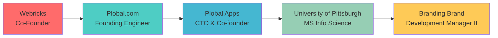

<div align="center">

# 👋 Hello, I'm Abhishek Jain

[](https://git.io/typing-svg)

</div>


## 🚀 About Me

```python
class AbhishekJain:
    def __init__(self):
        self.role = "Development Manager II @ Branding Brand"
        self.location = "Pittsburgh, PA 🇺🇸"
        self.experience = "10+ years"
        self.passion = "Building AI-powered solutions that scale"
        
    def current_focus(self):
        return [
            "🤖 Leading AI/ML initiatives",
            "🏗️ Architecting scalable systems",
            "👥 Mentoring high-performance teams",
            "📈 Driving engineering excellence"
        ]
    
    def achievements(self):
        return {
            "companies_founded": 2,
            "apps_built": "15,000+",
            "gmv_generated": "$10M+",
            "team_size_managed": 17,
            "countries_reached": 120
        }
```

## 🛠️ Tech Arsenal

### 🧠 AI/ML & LLMs


### 💻 Full-Stack Development


### ☁️ Cloud & DevOps


### 🗄️ Databases & Tools


## 🏆 Career Highlights

<div align="center">

| 🎯 **Achievement** | 📊 **Impact** |
|:------------------:|:-------------:|
| 🚀 **Apps Built** | 15,000+ mobile apps |
| 💰 **Revenue Generated** | $10M+ GMV |
| 🌍 **Global Reach** | 120+ countries |
| 👥 **Team Leadership** | Up to 17 developers |
| 📈 **Performance Boost** | 60-70% → 100%+ delivery |

</div>

## 💼 Professional Journey



## 🤖 AI Projects Portfolio

<details>
<summary>🔍 Click to explore my AI/ML innovations</summary>

### 🧠 **Shipcode AI Assistant**
- Built conversational FQL assistant with natural language processing
- Architected dedicated AI service with production endpoints
- Powered by OpenAI GPT-4 and custom evaluation frameworks

### 📊 **Predict Audit Status** 
- XGBoost classifier for retail risk prediction
- 40+ engineered features with SMOTE for class balancing
- Achieved production-ready accuracy with automated monitoring

### 🛒 **Smart Cart Analyzer**
- Multimodal CV & Voice solution for Instacart auditing
- GPT-4 Vision + ElevenLabs TTS integration
- Real-time cart analysis with HEIC→JPEG conversion

### 📚 **DevDocs Bot**
- RAG-powered documentation assistant
- FAISS vector storage with LangChain retrieval
- Streamlit interface with conversation memory

### 🎙️ **AbhiScript Platform**
- Full-stack AI transcription with speaker diarization
- AssemblyAI + GPT-4 pipeline for insights generation
- JWT auth, real-time progress, Whisper fallback

</details>

## 📊 GitHub Analytics

<div align="center">
  
  
</div>

<div align="center">
  
</div>

## 🎯 Current Focus Areas

- 🤖 **AI/ML Engineering**: Building production-ready AI systems at scale
- 🏗️ **System Architecture**: Designing resilient, scalable infrastructures  
- 👥 **Team Leadership**: Mentoring engineers and driving technical excellence
- 📈 **Performance Optimization**: Boosting delivery velocity and code quality

## 🌟 Fun Facts

- 🚀 Built my first company at 23 and made it profitable with 17 developers
- 🏆 Created the highest-rated mobile app platform on Shopify App Store
- 🌍 My apps have been used by businesses in 120+ countries
- 🎯 Increased team delivery velocity from 60-70% to over 100%
- 🧠 Solely conceived and built 5 major AI/ML initiatives as a one-person team

## 📫 Let's Connect!

<div align="center">

[](https://linkedin.com/in/jainabahishek)
[](https://twitter.com/jainabahishek)
[](mailto:your.email@gmail.com)
[](https://yourportfolio.com)

</div>

---

<div align="center">
  
  
  ### 💡 "Turning complex problems into elegant solutions, one algorithm at a time"
  
  <sub>⭐️ From [jainabahishek](https://github.com/jainabahishek)</sub>
</div> 